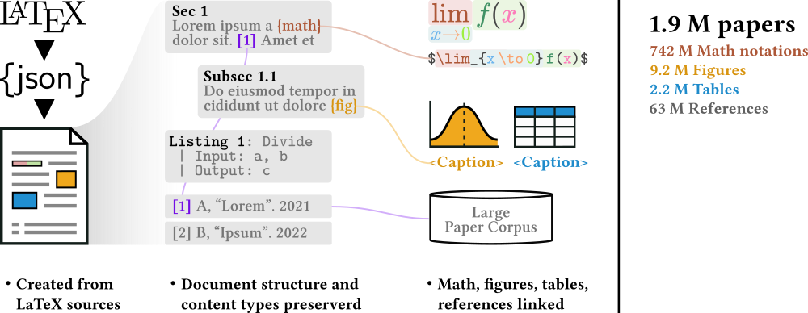

# L4NAT



(peer review version)

* **[Data](#data)** (`data/`)
* **[Code](#recreating-l4nat)** (`src/`)

### (re)creating L4NAT
Generating a data set for citation based tasks using arxiv.org submissions.

##### Prerequisites

* software
    * Tralics (Ubuntu: `# apt install tralics`)
    * latexpand (Ubuntu: `# apt install texlive-extra-utils`)
    * [GROBID](https://github.com/kermitt2/grobid)
* data
    * arXiv source files: see [arXiv.org help - arXiv Bulk Data Access](https://arxiv.org/help/bulk_data)
    * [OpenAlex](https://openalex.org/) (paper records only)

##### Usage

1. Prepare arXiv metadata with: `utility_scripts/generate_metadata_db.py`
2. Prepare OpenAlex DB with: `fill_openalex_postgresql_db.py`
3. Parse arXiv sources with: `prepare.py` (or `normalize_arxiv_dump.py` + `prase_latex_tralics.py`)
4. Match reference items with: `match_references.py`
5. Verify and analyze result with: `utility_scripts/calc_stats.py`


### Data

Find a preview sample in `data/`.

The sample contains data on 213 permissively licensed papers across 10 different years.

##### Data format

arXiv.org LaTeX sources are distributed in chunks named `arXiv_src_<yy><mm>_<counter>.tar`.

L4NAT is distributed as `arXiv_src_<yy><mm>_<counter>.jsonl` files. Each JSONL file contains the parsed contents of the respective source TAR. Each line in the JSONL is a JSON object describing a paper. An example is shown below.

##### Paper

```
{
  "paper_id": "2105.05862",
  "_pdf_hash": None,
  "_source_hash": "b7d5f27b5c8abc3bd8a44d875899fdc0d945a604",
  "_source_name": "2105.05862.gz",
  "metadata": {...},
  "abstract": {...},
  "body_text": [...],
  "bib_entries": {...},
  "ref_entries": {...}
}
```

One example paragraph in `body_text` is

```
{
  "section": "Memory wave form",
  "sec_number": "2.1",
  "sec_type": "subsection",
  "content_type": "paragraph",
  "text": "The gauge choice leading us to this solution does not fix "
          "completely all the gauge freedom and an additional constraint "
          "should be imposed to leave only the physical degrees of freedom. "
          "This is done by projecting the source tensor {{formula:7fd88bcd-"
          "9013-433d-9756-b874472530d9}}  into its transverse-traceless (TT) "
          "components (see for example {{cite:80dbb6c8b9c12f561a8e585faceac5f"
          "4e104d60d}}). Doing this and without loss of generality, we will "
          "use the following very well known ansatz for the source term "
          "proposed in {{cite:bc9a8ca19785627a087ae0c01abe155c22388e16}}\n",
  "cite_spans": [...],
  "ref_spans": [...]
}
```

where `{{formula:7fd88bcd-9013-433d-9756-b874472530d9}}` refers in `ref_entries` to

```
{
  "latex": "S_{\\mu \\nu }",
  "type": "formula"
}
```

and `{{cite:bc9a8ca19785627a087ae0c01abe155c22388e16}}`, for example, refers in `bib_entries` to

```
{
  "bib_entry_raw": "R. Epstein, The Generation of Gravitational Radiation by Escaping Supernova Neutrinos, Astrophys. J. 223 (1978) 1037.",
  "contained_arXiv_ids": [],
  "contained_links": [
    {
      "url": "https://doi.org/10.1086/156337",
      "text": "Astrophys. J. 223 (1978) 1037.",
      "start": 87,
      "end": 117
    }
  ],
  "ids" {...}
}
```
